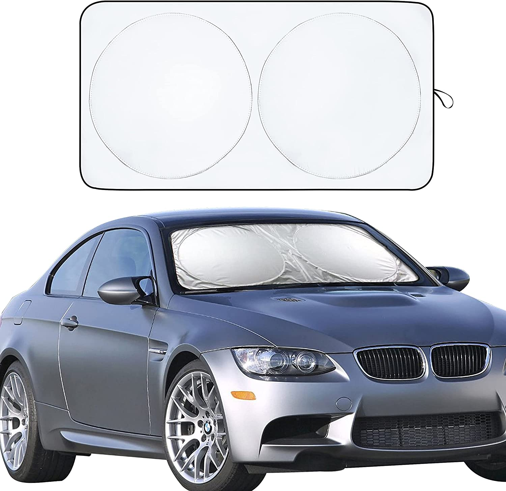
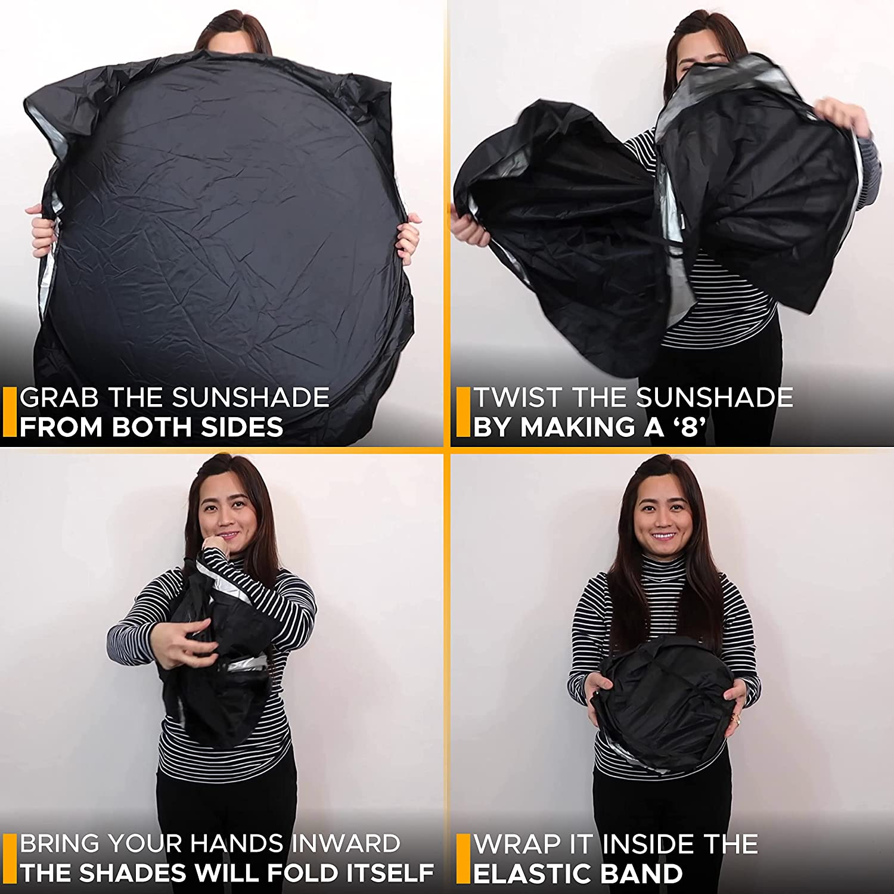
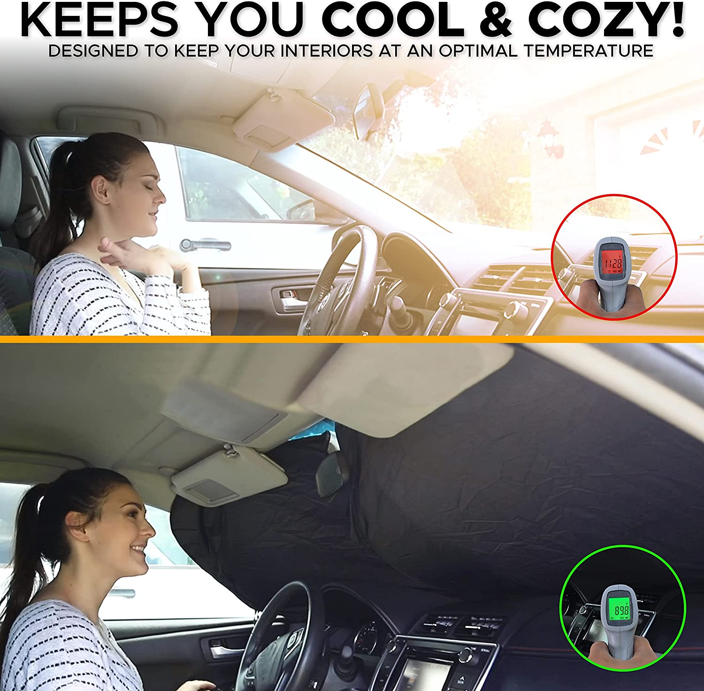
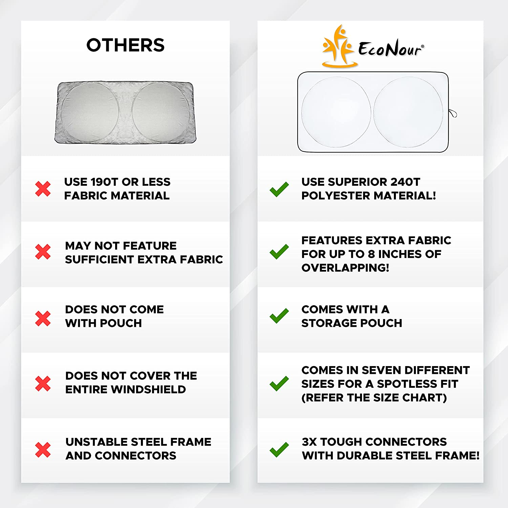
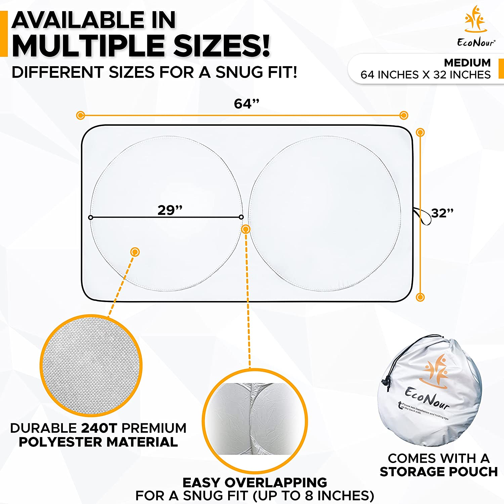

## Protect your car's interior and its passengers with this **Car Sun Visor**!

## **EcoNour** Car **Windshield Sun Shade**: The Best Way to **Protect Your Car** from the Sun

It’s hot outside. Do you have everything you need to keep your car cool? Of course not, because you don’t have the **EcoNour Car Windshield Sun Shade**! That’s why we’re here to tell you about this handy product that’s great for keeping your car cool in all kinds of weather conditions and situations – **hot**, **cold**, **sunny**, **rainy**, **snowy** and more! Don't just take our word for it - try it out for yourself! Read on to find out why the **EcoNour Car Windshield Sun Shade** is THE best way to protect your car from the sun.

## Why Invest in an EcoNour Car Windshield Sun Shade?

1. If you're looking for the **best car windshield sun shade** on the market, look no further than **EcoNour**. 
2. This **sun shade** is made of high-quality materials that will keep your car cool and protected from the sun's harmful rays. 
3. It's easy to install and comes with a **storage pouch** for easy transport.

## Benefits of Having an EcoNour Car Windshield Sun Shade

1. It's the **best car windshield sun shade** on the market, hands down. 
2. It's made of **high-quality materials** that will last for years. 
3. It has a built-in **storage pouch** so you can keep it with you at all times. 
4. It's easy to install and remove, so you can use it as needed. 
5. Did you know that by recycling you can help reduce your **carbon footprint**?

## Product Overview

The **EcoNour Car Windshield Sun Shade** is the best way to protect your car from the sun. It's made of a reflective material that reflects the sun's rays away from your car, keeping it cooler in the summer and warmer in the winter. It also comes with a storage pouch so you can keep it in your glove box or trunk when you're not using it.

## What Makes it Stand Out From Its Competitors?

The **EcoNour Car Windshield Sun Shade** is one of the **best car windshield sun shades** on the market because it is made of high-quality materials that are designed to last. It also has a storage pouch that makes it easy to store when not in use. Plus, the **EcoNour Car Windshield Sun Shade** comes with a money-back satisfaction guarantee, so you can be sure you're getting a product that will work well for you.

## Pros and Cons

The **EcoNour Car Windshield Sun Shade** is a great way to keep your car cool in the summer sun. It's easy to install and remove, and it folds up into a handy storage pouch when you're not using it. Plus, it's made of eco-friendly materials, so you can feel good about using it. However, there are a few downsides.

## How Does the Hanging Strap Work?

The **EcoNour sun shade** has a hanging strap that you can use to secure it to your car's rearview mirror. This is a great way to keep the **sun shade** in place and make sure it doesn't blow away in the wind. Plus, it's easy to take down and put back up, so you can use it as often as you like.

## Is It Possible to Have a Single Unit for Both Front Windows?

Most **sun shades** are designed for a single window, but the **EcoNour sun shade** can be used for both front windows. It's easy to install and remove, and it's made of a durable material that will last for years. Plus, it has a storage pouch so you can keep it in your car when you're not using it.

## How Can I Clean My EcoNour Windscreen Cover?

If your **EcoNour windshield** cover gets dirty, don't worry! Cleaning it is easy. Just remove the cover from your car and wash it with soap and water. If your garment is particularly dirty, you may want to use a mild detergent. Once it's clean, dry it off and put it back on your car. That`s all there may be to it!

## FAQs Section - Frequently Asked Questions about This Product

1. What is the **EcoNour Car Windshield Sun Shade**? 
2. How does it work? 
3. Why do I need one? 
4. What are the benefits of using an **EcoNour Car Windshield Sun Shade**? 
5. How do I use it?

# Get this now

## For US or Worldwide users

## For UK users only

## For Indian users

